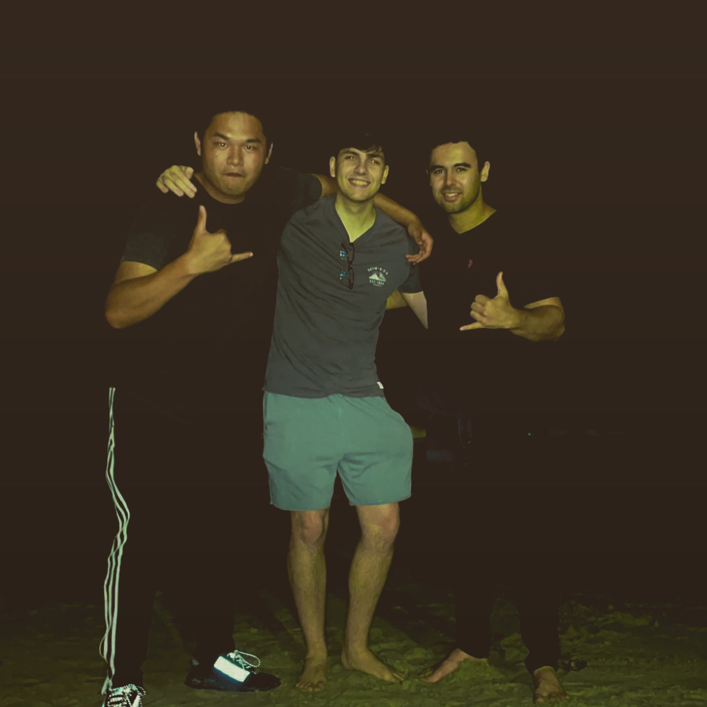
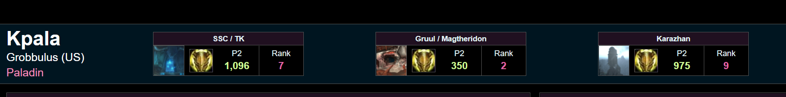

# Chris Harness
***[Instagram](https://instagram.com/chrisharness_)***


*Let me tell you a bit about myself.*

## Who am I? ##

~~I am the greatest programmer alive~~
**I am a humble Computer Science student!!!**


### Pictured Above is Eric (Covid-Year + Current Roommate) -> Me (Chris) -> Gavin (Covid-Year Roommate) ###

This picture was taken at the Encinitas Beach, nearby Gavin's home.
[Link to Photo](screenshots/me.JPG)

## Ok, but who am I as a programmer? ##

For one, I am definitely not the greatest programmer, (yet)

I am a second-year transfer student at UCSD currently, so I am developing and honing my skills to hopefully one day become a Software Engineer. 

In terms of how we can get along...

```

while(YouAreHonestAndKind){
    we.maintainFriendship();
}

```
## Ok...But I still don't know who you are? ##

I'm glad you asked. *Some* of my hobbies include:

- Working Out
- Gaming
- Cooking for myself and family


### A subtle flex ###

**My favorite game at the moment is *World of Warcraft***



These are my current world rankings for the class I play ( I play a tank, which carries tons of responsibility and leadership skills, as well as mechanical ability. This measurement is based on my percentile relation to the top performers of my class. As you can see, I'm pretty decent. There are about 30K+ other people who play the class I do for context.)

## Ok that's kind of cool, you seem like a nerd though. ##

That is true. You may be asking yourself how I even have the time to commit to a game like that. To be honest, I'm not sure how much longer I will be playing since my real life is ramping up, but I've learned lots of great life lessons and met some cool people. 

Some important takeaways from my gaming experience:

1. Not everyone has patience, although I believe it can be developed.
2. Controlling your emotions is a skill.
3. Be friendly to everyone, because you never know when they may appear in your life again.

## My goals for this year ##
- [ ] Try my hardest in school.
- [ ] Continuously attempt to make new friends. Connections can last a lifetime.
- [ ] Branch out my cooking skills from the basics.
- [ ] Drink more coffee (it helps with my productivity)
- [ ] Don't slack off in the gym. Stay ahead of schedule so you can stay healthy!


